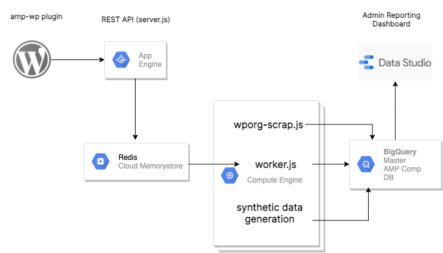

# AMP Compatibility

AMP compatibility project to make WordPress ecosystem AMP compatible.

**Contributors:** [Google], [rtCamp], [Alberto Medina], [Rahul Bansal], [Weston Ruter], [Paul Clark], [Riddhesh Sanghvi], [Gagan Deep Singh], [Dhaval Parekh]

---

## Description

**The key components of the project.**

1.  **[AMP compatibility server]** 

    The AMP compatibility server is a Node JS application based on the [AdonisJS] framework. Which is responsible for following actions.

    - Collecting data sent from AMP sites and store that into the BigQuery dataset.
    - Fetch and store plugins and themes from [WordPress.org] to BigQuery dataset, And keep dataset up to date with [WordPress.org].
    - Generate a synthetic site for an individual plugin and theme from [WordPress.org] and store AMP errors information in BigQuery.
    - Provide a dashboard to admin user to add adhoc request to generate synthetic data of combination of plugins and theme.

    Please check more information [here](./amp-compatibility-server/README.md).

2.  **[AMP WP Dummy data generator]** 

    The Dummy data generator is a WordPress plugin. Which is responsible for generating ideal content for the AMP site. So it can expose maximum AMP errors.

    Please check more information [here](./amp-wp-dummy-data-generator/README.md).

3.  **Reporting dashboard** 

    The Reporting dashboard to show user to see various reports.

## Infrastructure

## Local environment setup.

### Required software
- [Node JS](https://nodejs.org/) (v14.15.3)
- [Npm JS](https://www.npmjs.com/)
- [Adonis CLI](https://adonisjs.com/) ( `npm i -g @adonisjs/cli` )
- [Redis](https://redis.io/)
- For Ubuntu
    - [WordOps](https://wordops.net/)
- For Mac
    - [Laravel Valet](https://laravel.com/docs/8.x/valet)
    - [WP CLI valet command](https://github.com/aaemnnosttv/wp-cli-valet-command#installing) 

Please check [here](./amp-compatibility-server#setup) to set up AMP compatibility server.

Please check [here](./amp-wp-dummy-data-generator#setup) to set up AMP WP dummy data generator.

[AMP compatibility server]: ./amp-compatibility-server/README.md
[AMP WP Dummy data generator]: ./amp-wp-dummy-data-generator/README.md
[Google]: https://profiles.wordpress.org/google
[rtCamp]: https://github.com/rtCamp/
[Alberto Medina]: https://profiles.wordpress.org/albertomedina/
[Rahul Bansal]: https://github.com/rahul286
[Weston Ruter]: https://github.com/westonruter
[Paul Clark]: https://github.com/pdclark
[Riddhesh Sanghvi]: https://github.com/mrrobot47
[Gagan Deep Singh]: https://github.com/gagan0123
[Dhaval Parekh]: https://github.com/dhaval-parekh
[AdonisJS]: https://adonisjs.com/
[WordPress.org]: https://wordpress.org/